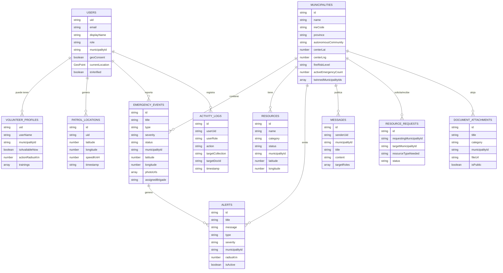

# Informe de Estado: Previncendios España

> **Fecha**: 29 de julio de 2026  
> **Versión del proyecto**: 0.0.0  
> **Autor**: Revisión técnica automatizada  
> **Propósito**: Documentar el estado real de la aplicación frente al prompt original, identificar bloqueadores, funcionalidades a medias, módulos completos y proponer un roadmap priorizado para completar la plataforma en sesiones sucesivas.

---

## 1. Resumen ejecutivo

**Previncendios España** es una plataforma web en desarrollo para prevención y gestión de incendios y emergencias, construida con React 19, TypeScript, Tailwind 4, Vite 6 y Firebase. La interfaz visual, el mapa operativo, el motor satelital FIRMS multi-fuente, la persistencia Firestore en tiempo real y múltiples integraciones externas están funcionales. Quedan pendientes FCM push, Firebase Storage, service worker/PWA offline, code-splitting, tests y endurecimiento final de reglas de seguridad.

**Estado global**: `Prototipo visual y funcional con autenticación real y persistencia Firestore conectadas; datos de respaldo mock para modo demo.`

> 📋 **Configuración rápida**: si aún no tienes un proyecto Firebase vinculado, sigue `docs/FIREBASE_SETUP.md` para crearlo, obtener la configuración y conectar la app.

> ✅ **Progreso reciente**: `AuthContext`, `RegisterModal`, `Header` y `RoleSelectorModal` usan Firebase Auth + Firestore. `EmergencyContext` escribe y lee en tiempo real de Firestore. Motor satelital (`src/services/fireDetectionEngine.ts`) descarga datos reales NASA FIRMS (VIIRS_NOAA20/SNPP, MODIS), consulta Open-Meteo y OpenWeather, analiza con Gemini y crea incidencias automáticamente. Se añadieron capa WMS de FIRMS, feed público de focos, alertas geolocalizadas para invitados, calidad del aire (Open-Meteo), enlaces Google Maps, avisos AEMET oficiales, botón de emergencia 112, permiso de notificaciones del navegador, y se limpiaron dependencias no usadas. Quedan FCM push, Firebase Storage, PWA/service worker, code-splitting y endurecer `firestore.rules`.

---

## 2. Cumplimiento por fases del prompt original

### FASE 1 — Resumen, supuestos, arquitectura, roles y flujos

- ✅ **Resumen y visión**: Definida en `docs/FASE_1_RESUMEN_EJECUTIVO.md`.
- ✅ **Roles identificados**: 5 roles (`superadmin`, `ayuntamiento`, `voluntario`, `ciudadano`, `invitado`) en `src/types/index.ts`.
- ✅ **Matriz RBAC inicial**: En `docs/FASE_1_RESUMEN_EJECUTIVO.md`.
- ⚠️ **Flujos por rol**: La UI los sugiere, pero no hay enrutamiento ni guards de acceso.

### FASE 2 — Estructura técnica, modelo de datos, autenticación y reglas

- ✅ **Estructura de carpetas**: Limpia y modular (`src/components/*`, `src/pages/*`, `src/services/*`).
- ⚠️ **Modelo de datos**: Tipos TypeScript completos, pero Firestore no está poblado ni se lee/escribe en la mayoría de módulos.
- ✅ **Autenticación real**: `AuthContext` usa `onAuthStateChanged` de Firebase Auth, registro/login con email, Google y perfiles en Firestore.
- ⚠️ **Reglas de seguridad**: `firestore.rules` propuesta incluye control por municipio/rol, pero aún no se despliega como producción.

### FASE 3 — Diseño de pantallas, rutas, navegación y componentes

- ✅ **Diseño de pantallas**: Dashboards, mapa, incidencias, alertas, recursos, voluntarios, comunicaciones, documentos y auditoría.
- ⚠️ **Rutas**: La navegación sigue por tabs en `App.tsx`; React Router no está implementado.
- ✅ **Navegación por rol**: Sidebar filtra items por rol.
- ⚠️ **Componentes**: Reutilizables en parte (`StatCard`, `Badge`), pero hay duplicación de lógica.

### FASE 4 — Implementación real de código base

- ✅ **Layout, login (visual), dashboard, mapa, CRUD de incidencias**.
- ✅ **Gestión de usuarios y roles**: `AuthContext` usa `onAuthStateChanged`, registro/login con email, Google y cierre de sesión reales. Guarda y lee perfiles de `users` en Firestore.
- ✅ **Persistencia operativa**: `EmergencyContext` escucha colecciones de Firestore en tiempo real y escribe incidencias, alertas, recursos, solicitudes, bandos, voluntarios, patrullas y logs.
- ✅ **Motor satelital + IA**: `fireDetectionEngine.ts` descarga puntos calientes de NASA FIRMS, consulta OpenWeather, los analiza con Gemini y crea incidencias automáticamente. Incluye predicción de dirección de propagación basada en viento.
- ⚠️ **Notificaciones**: Se implementaron notificaciones del navegador (`Notification API`) para alertas de fuego cercano. Falta Firebase Cloud Messaging (FCM) push real.
- ⚠️ **Reglas e índices de Firestore**: Existen reglas RBAC por municipio/rol, pendientes de despliegue formal en producción.

### FASE 5 — Revisión técnica, riesgos, mejoras y producción

- ❌ **Revisión técnica**: No está firmemente documentada como código (el `docs/FASE_5_*` afirma cosas sin cumplirse).
- ⚠️ **Riesgos**: Claves expuestas en el historial (ya corregido), reglas permisivas, persistencia mock.
- ❌ **Checklist de producción**: No se cumplen la mayoría de items reales.

---

## 3. Módulos funcionales obligatorios: estado detallado

### 3.1 Autenticación y perfiles

| Funcionalidad | Estado | Comentario |
|---------------|--------|------------|
| Registro con email y contraseña | ⚠️ A medias | `RegisterModal.tsx` conecta con Firebase Auth, pero el estado global no se sincroniza. |
| Login / logout | ⚠️ A medias | `AuthContext` es simulado; el login real de Firebase Auth no se usa. |
| Recuperación de contraseña | ❌ No implementado | No hay flujo ni componente. |
| Alta por invitación institucional | ❌ No implementado | No hay sistema de invitaciones. |
| Perfil de usuario con geoconsentimiento | ⚠️ A medias | Existe en tipos y UI, pero no se persiste. |

**Problemas detectados**:

- `AuthContext` tiene `defaultAyuntamiento` como usuario por defecto (`src/context/AuthContext.tsx:103`).
- `loginDemoRole` cambia el usuario en memoria, no consulta Firestore.
- `RegisterModal` guarda en Firestore, pero luego llama a `loginDemoRole` con datos locales, ignorando la respuesta de Firebase.
- No hay protección de rutas: un invitado puede ver el panel de voluntarios cambiando el tab.

### 3.2 Gestión de incidencias

| Funcionalidad | Estado | Comentario |
|---------------|--------|------------|
| Crear incidencia | ✅ Implementado | `NewIncidentModal.tsx` con campos completos. |
| Editar incidencia | ⚠️ A medias | Solo se puede cambiar estado/severidad/brigada. |
| Asignar / escalar | ⚠️ A medias | Campo `assignedBrigade` editble, pero sin flujo de escalado. |
| Cerrar incidencia | ✅ Implementado | Estados `extinguido` y `falsa_alarma`. |
| Tipos de incidencia | ✅ Implementado | 8 tipos en `IncidentType`. |
| Prioridad, gravedad, estado, origen | ✅ Implementado | En tipos y UI. |
| Evidencia (fotos) | ⚠️ A medias | Campo `photoUrls` existe, pero no hay upload real. |

**Problemas detectados**:

- `EmergencyContext` sincroniza incidencias con Firestore en tiempo real y conserva `initialEmergencyEvents` como fallback offline.
- No hay paginación, ni ordenación avanzada, ni búsqueda geoespacial.
- Las fotos usan URLs de Unsplash en los datos mock.

### 3.3 Centro de alertas

| Funcionalidad | Estado | Comentario |
|---------------|--------|------------|
| Crear alerta | ✅ Implementado | `CreateAlertModal.tsx`. |
| Desactivar alerta | ✅ Implementado | Botón en `AlertCenter.tsx`. |
| Filtrar por severidad / tipo | ✅ Implementado | Filtros por municipio, provincia, tipo, severidad, estado y búsqueda. |
| Notificaciones push | ⚠️ Parcial | `Notification API` del navegador para fuego cercano; FCM/SW pendiente. |
| Historial de alertas | ✅ Implementado | Lista con estado activo/inactivo. |
| Plantillas de mensajes | ❌ No implementado | Campos libres, sin plantillas predefinidas. |

### 3.4 Mapa operativo en tiempo real

| Funcionalidad | Estado | Comentario |
|---------------|--------|------------|
| Mapa interactivo | ✅ Implementado | Leaflet en `EmergencyMap.tsx`. |
| Capas de incidencias | ✅ Implementado | Marcadores con severidad y pulso. |
| Capa FIRMS satelital | ✅ Implementado | Datos reales de FIRMS (VIIRS/MODIS) con múltiples fuentes; capa WMS opcional. |
| Capa de recursos | ✅ Implementado | Marcadores por categoría. |
| Capa de patrullas | ✅ Implementado | Mock en `mockData.ts`. |
| Filtros por tipo / estado / distancia | ✅ Implementado | Filtros por municipio, provincia, tipo, severidad, estado y búsqueda. Distancia real en mapa/alerts como mejora futura. |
| Vista pública / operativa | ⚠️ A medias | `mapLayers` controla visibilidad de incidencias, focos satelitales, recursos y patrullas; falta geofencing. |
| Google Maps / Mapbox | ⚠️ A medias | Se añadieron enlaces de navegación Google Maps desde popups y mobilizaciones. Mapa base sigue siendo OSM/Esri/OpenTopoMap. |

**Problemas detectados**:

- No hay clustering de marcadores (puede saturarse con muchos incidentes).
- No hay cálculo de distancia ni geofencing.
- La ubicación GPS del usuario se actualiza en estado local pero no se envía a Firestore.

### 3.5 Coordinación de recursos

| Funcionalidad | Estado | Comentario |
|---------------|--------|------------|
| Inventario de recursos | ✅ Implementado | `ResourceList.tsx` con estados y categorías. |
| Cambio de estado | ✅ Implementado | Select de estado para superadmin/ayuntamiento. |
| Solicitud intermunicipal | ✅ Implementado | `ResourceRequestModal.tsx`. |
| Aceptar / rechazar cesión | ✅ Implementado | Botones en `ResourceList.tsx`. |
| Puntos de agua, refugios, drones | ✅ Implementado | En datos mock y tipos. |

### 3.6 Comunicaciones

| Funcionalidad | Estado | Comentario |
|---------------|--------|------------|
| Bandos oficiales | ✅ Implementado | `CreateBandoModal.tsx` y `AnnouncementsList.tsx`. |
| Mensajería segmentada | ⚠️ A medias | Campo `targetRoles` en tipos, pero no se filtra visualmente. |
| Tablón de instrucciones | ⚠️ A medias | Lista de mensajes, sin confirmación de lectura. |
| Gmail / contactos | ⚠️ A medias | Componente `GmailContactsIntegration.tsx` con mock. |

### 3.7 Paneles de control

| Funcionalidad | Estado | Comentario |
|---------------|--------|------------|
| Dashboard superadmin | ✅ Implementado | `SuperAdminDashboard.tsx`. |
| Dashboard municipal | ✅ Implementado | `MunicipalDashboard.tsx`. |
| Dashboard ciudadano/voluntario | ✅ Implementado | `CitizenDashboard.tsx` muy completo. |
| Dashboard invitado | ⚠️ A medias | `GuestDashboard.tsx` es básico. |
| KPIs | ✅ Implementado | Tarjetas `StatCard` con cálculos. |

### 3.8 Auditoría y trazabilidad

| Funcionalidad | Estado | Comentario |
|---------------|--------|------------|
| Registro de acciones | ✅ Implementado | `logActivity` en `EmergencyContext`. |
| Auditoría detallada | ⚠️ A medias | `AuditLogsList.tsx` básico, sin filtros avanzados. |
| IP y timestamp | ⚠️ A medias | Campo `ipAddress` en tipos, siempre hardcodeado en mock. |

### 3.9 Gestión documental

| Funcionalidad | Estado | Comentario |
|---------------|--------|------------|
| Biblioteca de documentos | ⚠️ A medias | `DocumentLibrary.tsx` lista documentos. |
| Subida de archivos | ❌ No implementado | No hay integración con Firebase Storage. |
| Diferenciación pública/privada | ✅ Implementado | Campo `isPublic` en tipos. |

---

## 4. Problemas técnicos

### 4.1 Errores de compilación

```
src/firebase/config.ts:11 - error TS2339: Property 'env' does not exist on type 'ImportMeta'.
```

**Estado**: ✅ Resuelto. `tsconfig.json` incluye `"types": ["vite/client", "node"]` y `tsc --noEmit` pasa.

### 4.2 Deuda técnica y code smell

- ✅ `as any` en `ResourceList.tsx:189` tipado con `OperationalResource['status']`.
- ✅ Uso de `document.getElementById` en popups de Leaflet reemplazado por `popupContent.querySelector('button')`.
- ✅ `setIsSidebarOpen(!isSidebarOpen)` corregido a función estable `setIsSidebarOpen((prev) => !prev)`.
- ✅ `index.html` título en español y `lang="es"`.
- ✅ `package.json` renombrado a `previncendios` y limpieza de dependencias no usadas.

### 4.3 Dependencias

- ✅ Eliminadas dependencias no usadas: `@google/genai`, `express`, `dotenv`, `tsx`, `@types/express`, `esbuild`.
- ✅ `vite`, `@vitejs/plugin-react`, `@types/leaflet` movidos a `devDependencies`.
- ✅ Tailwind 4 con `@import "tailwindcss"` funciona correctamente.

---

## 5. Problemas de seguridad y privacidad

### 5.1 Historial de secretos

- ✅ Se detectó y eliminó del historial la API Key de Firebase expuesta; `.gitignore` actualizado.
- **Acción pendiente**: rotar la clave en Google Cloud Console si aún no se ha hecho.

### 5.2 Reglas de Firestore

El archivo `firestore.rules` actual:

```
match /emergencyEvents/{eventId} {
  allow read: if true;       // Público
  allow create, update: if isSignedIn();  // Cualquier usuario logueado
  allow delete: if false;
}
```

**Problemas**:

- Cualquier usuario autenticado puede crear/actualizar incidencias, alertas y mensajes sin verificación de rol o municipio.
- No hay separación por `municipalityId`.
- No hay validación de propiedad de documentos (`resource.data` no se consulta).
- `emergencyEvents`, `alerts`, `messages` son legibles por cualquiera (incluido invitado sin auth), pero el prompt pide vista pública limitada y datos operativos privados.

### 5.3 Autenticación y autorización

- No hay protección de rutas.
- No hay verificación de email/invitación para roles institucionales (`ayuntamiento`, `superadmin`).
- `RegisterModal` permite registrarse como `superadmin` sin validación.
- La geolocalición de voluntarios y ciudadanos se trata en memoria sin persistir ni ofuscar.

### 5.4 Privacidad

- La posición exacta de voluntarios (`patrolLocations`) no tiene control de consentimiento explícito en tiempo real.
- `photoUrls` de incidencias podrían contener metadatos EXIF con ubicación exacta si no se sanitizan.

---

## 6. Problemas de arquitectura y escalabilidad

### 6.1 Persistencia

- `EmergencyContext` escucha Firestore en tiempo real para la mayoría de colecciones, con `initial*` como fallback offline.
- `RegisterModal`, `NewIncidentModal`, `ResourceList`, `AlertCenter`, `CreateBandoModal` y otros componentes escriben en Firestore.
- No hay caché offline, reintentos ni manejo de conectividad intermitente.

### 6.2 Estructura de datos

- Tipos bien definidos en `src/types/index.ts`.
- Faltan relaciones normalizadas: `municipalities` debería tener `provinceId`, `autonomousCommunityId`.
- `FilterState` usa strings en español (`'todas'`, `'todos'`) que son frágiles; debería usar `undefined` o enums.

### 6.3 Rendimiento

- ⚠️ No hay lazy loading de componentes; `App.tsx` importa todos los modales y páginas al inicio.
- ✅ `EmergencyMap` usa renderizado Canvas y diff de focos para evitar re-renders innecesarios.
- ⚠️ No hay paginación en listas.

### 6.4 Integraciones externas

- FIRMS ya consulta datos reales (`fireDetectionEngine.ts`) y AEMET obtiene avisos oficiales desde el RSS del servicio (`aemetService.ts`).
- Open-Meteo (clima y calidad del aire) y OpenWeather funcionan sin o con clave respectivamente.
- Enlaces de llamada al 112 y navegación Google Maps disponibles en dashboard y ficha de incidencia.

### 6.5 Firebase Services faltantes

- Firebase Cloud Messaging (notificaciones push real).
- Firebase Storage (subida de fotos y documentos).
- Firebase Functions (lógica de servidor para notificaciones y validaciones seguras).
- ✅ Firebase Hosting configurado y desplegado.

---

## 7. Problemas de UX/UI y accesibilidad

### 7.1 Aspectos positivos

- Modo claro/oscuro implementado con `ThemeContext`.
- Paleta de colores funcional (rojo, ámbar, azul, verde).
- Botones grandes y tarjetas táctiles.
- Mapa central con iconografía clara.

### 7.2 Aspectos a mejorar

- **`index.html`**: título y metadatos PWA actualizados (`manifest.json`, `theme-color`, `color-scheme`). Falta service worker.
- **Accesibilidad**: muchos botones carecen de `aria-label` o textos descriptivos.
- ✅ **Idioma**: `index.html` y `package.json` están en español/correctamente nombrados.
- **Responsive**: el layout con sidebar fijo puede mejorar en tablets pequeñas.
- **Estados de carga y error**: se añadieron mensajes de carga y vacío en dashboards; skeletons no implementados.
- **Formularios**: algunos campos no tienen validación (municipio libre, contraseña sin fortaleza).

### 7.3 PWA

- `manifest.json` e icono `icon.svg` existen.
- Service worker no implementado.
- Estrategia de caché offline no implementada.

---

## 8. Modelo de datos (Firestore)

### 8.1 Colecciones definidas en tipos



### 8.2 Índices recomendados en Firestore

```
emergencyEvents:
  - municipalityId ASC, createdAt DESC
  - status ASC, severity ASC
  - type ASC, municipalityId ASC

alerts:
  - municipalityId ASC, isActive DESC, createdAt DESC
  - severity ASC, isActive DESC

resources:
  - municipalityId ASC, status ASC
  - category ASC, municipalityId ASC

patrolLocations:
  - uid ASC, timestamp DESC
  - municipalityId ASC, timestamp DESC

activityLogs:
  - userUid ASC, timestamp DESC
  - municipalityId ASC, timestamp DESC
```

### 8.3 Reglas de seguridad propuestas

```
rules_version = '2';
service cloud.firestore {
  match /databases/{database}/documents {
    function isSignedIn() {
      return request.auth != null;
    }

    function getUserRole() {
      return isSignedIn() ? get(/databases/$(database)/documents/users/$(request.auth.uid)).data.role : 'invitado';
    }

    function getUserMunicipality() {
      return isSignedIn() ? get(/databases/$(database)/documents/users/$(request.auth.uid)).data.municipalityId : null;
    }

    function isSuperAdmin() {
      return isSignedIn() && getUserRole() == 'superadmin';
    }

    function isAyuntamiento() {
      return isSignedIn() && getUserRole() == 'ayuntamiento';
    }

    function belongsToMunicipality(muniId) {
      return isSignedIn() && (getUserMunicipality() == muniId || isSuperAdmin());
    }

    match /users/{userId} {
      allow read: if isSuperAdmin() || isAyuntamiento() || request.auth.uid == userId;
      allow create: if isSignedIn() && request.auth.uid == userId;
      allow update: if isSuperAdmin() || request.auth.uid == userId;
      allow delete: if isSuperAdmin();
    }

    match /municipalities/{muniId} {
      allow read: if true;
      allow write: if isSuperAdmin();
    }

    match /emergencyEvents/{eventId} {
      allow read: if resource.data.municipalityId == getUserMunicipality() || resource.data.isPublic == true || isSuperAdmin();
      allow create: if isSignedIn() && (isSuperAdmin() || isAyuntamiento() || getUserRole() == 'voluntario' || getUserRole() == 'ciudadano');
      allow update: if isSuperAdmin() || isAyuntamiento() && resource.data.municipalityId == getUserMunicipality();
      allow delete: if isSuperAdmin();
    }

    match /alerts/{alertId} {
      allow read: if resource.data.municipalityId == getUserMunicipality() || resource.data.isPublic == true || isSuperAdmin();
      allow create, update: if isSuperAdmin() || (isAyuntamiento() && request.resource.data.municipalityId == getUserMunicipality());
      allow delete: if isSuperAdmin();
    }

    match /resources/{resourceId} {
      allow read: if true;
      allow create, update: if isSuperAdmin() || (isAyuntamiento() && resource.data.municipalityId == getUserMunicipality());
      allow delete: if isSuperAdmin();
    }

    match /resourceRequests/{requestId} {
      allow read: if isSuperAdmin() || resource.data.requestingMunicipalityId == getUserMunicipality() || resource.data.targetMunicipalityId == getUserMunicipality();
      allow create: if isAyuntamiento() && request.resource.data.requestingMunicipalityId == getUserMunicipality();
      allow update: if isSuperAdmin() || resource.data.targetMunicipalityId == getUserMunicipality();
      allow delete: if isSuperAdmin();
    }

    match /patrolLocations/{patrolId} {
      allow read: if isSuperAdmin() || isAyuntamiento() || resource.data.uid == request.auth.uid;
      allow create, update: if isSignedIn() && (resource.data.uid == request.auth.uid || isSuperAdmin());
      allow delete: if isSuperAdmin();
    }

    match /messages/{messageId} {
      allow read: if isSignedIn() && (resource.data.municipalityId == getUserMunicipality() || resource.data.targetRoles.hasAny([getUserRole()]) || isSuperAdmin());
      allow create, update: if isSuperAdmin() || (isAyuntamiento() && request.resource.data.municipalityId == getUserMunicipality());
      allow delete: if isSuperAdmin();
    }

    match /documents/{docId} {
      allow read: if resource.data.isPublic == true || isSuperAdmin() || (isSignedIn() && resource.data.municipalityId == getUserMunicipality());
      allow create, update, delete: if isSuperAdmin() || (isAyuntamiento() && resource.data.municipalityId == getUserMunicipality());
    }

    match /activityLogs/{logId} {
      allow read: if isSuperAdmin() || isAyuntamiento();
      allow create: if isSignedIn();
      allow update, delete: if isSuperAdmin();
    }

    match /{document=**} {
      allow read, write: if false;
    }
  }
}
```

---

## 9. Roadmap de mejoras por sesión

### Sesión A — Fundamentos: build, PWA y autenticación real

1. Corregir `tsconfig.json` para soportar `import.meta.env`.
2. Actualizar `index.html` (título, lang="es", metadatos PWA, theme-color).
3. Crear `manifest.json` y service worker básico para PWA.
4. Refactorizar `AuthContext` para escuchar `onAuthStateChanged` de Firebase Auth.
5. Sincronizar `RegisterModal` y `Login` con el `AuthContext` real.
6. Bloquear registro como `superadmin`/`ayuntamiento` sin invitación.

### Sesión B — Firestore: leer y escribir datos reales

1. Migrar `EmergencyContext` a un adapter Firestore con fallback offline.
2. Crear servicios CRUD para `emergencyEvents`, `alerts`, `resources`, `messages`.
3. Implementar `onSnapshot` en dashboards para datos en tiempo real.
4. Añadir estados de carga, error y vacío en todos los listados.
5. Implementar paginación en Firestore para listas largas.

### Sesión C — Seguridad y permisos

1. Desplegar las `firestore.rules` propuestas y probar con el emulador.
2. Añadir `municipalityId` validation en creación/actualización de documentos.
3. Implementar `Claims` personalizados para `superadmin`/`ayuntamiento`.
4. Crear función Cloud para invitaciones institucionales.
5. Rotar API Key de Firebase en Google Cloud Console.

### Sesión D — Mapa y geolocalización

1. Añadir clustering de marcadores.
2. Implementar filtro por distancia desde la posición del usuario.
3. Dibujar zonas de riesgo y geofencing.
4. Sincronizar ubicación de voluntarios a Firestore con consentimiento.
5. Preparar integración real con FIRMS y AEMET (claves por entorno).

### Sesión E — Notificaciones, comunicaciones y documentos

1. Integrar Firebase Cloud Messaging (tokens, suscripción por rol/municipio).
2. Crear plantillas de alertas y envío segmentado.
3. Implementar confirmación de lectura de bandos.
4. Integrar Firebase Storage para fotos de incidencias y documentos PDF.
5. Añadir validación de roles en `DocumentLibrary` (público/privado).

### Sesión F — UX/UI, accesibilidad y producción

1. Revisar contrastes y añadir `aria-label`s.
2. Implementar skeletons y estados vacíos consistentes.
3. Mejorar navegación móvil y tablet.
4. Crear `firebase.json` para despliegue en Firebase Hosting.
5. Configurar GitHub Actions para lint y build.
6. Añadir tests unitarios básicos con Vitest.

---

## 10. Checklist de producción

| Requisito | Estado |
|-----------|--------|
| TypeScript sin errores (`tsc --noEmit`) | ✅ |
| Build de Vite exitoso | ✅ |
| PWA instalable (manifest, SW) | ⚠️ Manifest e icono listos, falta service worker |
| Autenticación real y segura | ✅ Firebase Auth + perfiles Firestore; falta invitaciones y claims |
| Firestore rules RBAC con municipios | ⚠️ Reglas propuestas, pendientes de despliegue formal |
| Persistencia real (no solo mock) | ✅ Firestore en tiempo real con fallback mock |
| Notificaciones push (FCM) | ⚠️ Notificaciones de navegador activas; FCM pendiente |
| Subida de archivos (Storage) | ❌ |
| Integraciones FIRMS/AEMET reales | ✅ FIRMS/Open-Meteo/AEMET RSS; EFFIS/others pendiente |
| Despliegue en Firebase Hosting/Vercel | ✅ `https://previncendios-espana.web.app` |
| Tests automáticos | ❌ |
| CI/CD | ❌ |

---

## 11. Conclusiones y próximos pasos inmediatos

La aplicación ha evolucionado de prototipo funcional a una plataforma con datos reales y persistencia Firestore. Los bloqueadores críticos restantes para producción son:

1. **Firebase Cloud Messaging** para notificaciones push reales (tokens, suscripción por rol/municipio).
2. **Firebase Storage** para subida de fotos de incidencias y documentos PDF.
3. **Service worker y estrategia offline** para PWA y caché.
4. **Code-splitting** y lazy loading de modales/páginas para reducir el bundle (~1.3 MB).
5. **Despliegue formal de `firestore.rules` e índices** y ajustes de seguridad.
6. **Tests automáticos** (Vitest) y CI/CD.
7. **Geofencing, clustering de marcadores y rutas optimizadas**.

El informe debe actualizarse al finalizar cada sesión marcando los items completados del roadmap.
